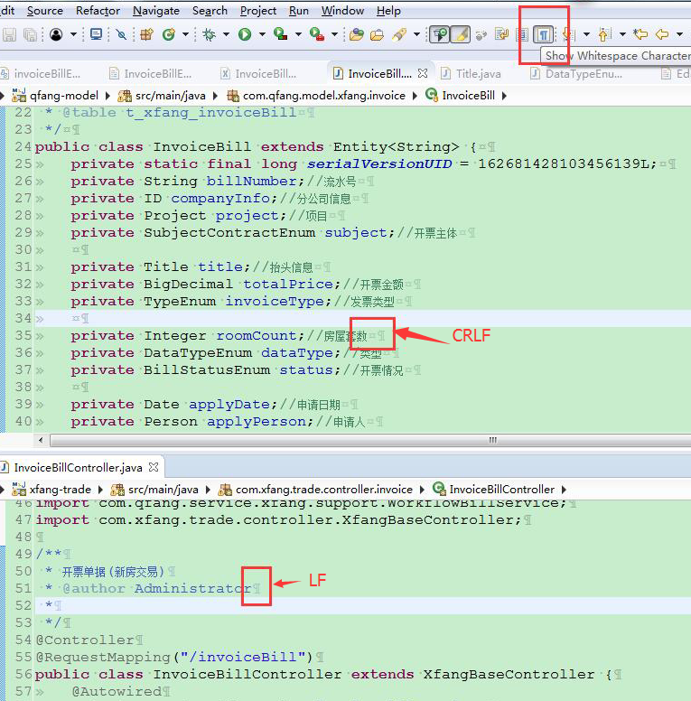

# 关于 git 中不同平台/开发工具换行符不一致导致冲突的问题

默认情况下 window 的换行符是 CRLF，unix 的换行符是 LF，MAC 的换行符是 CR
> - window 里面的换行符是 <回车 CR \r><换行 LF \n>  
> - unix 系统中只有 <换行 LF \n>

在 git 不同分支中如果文件的换行符格式不一致，在进行分支之间代码合并时，会出现全文冲突的情况，git 无法自动合并，而且 `git diff` 也无法使用。所以在跨不同平台/不同开发工具进行协作开发时，一定要注意换行符格式的统一，要不然会出现大量不必要的冲突问题。

### git 换行符相关参数配置

`autocrlf` 配置
``` shell
# 提交时转换为LF，检出时转换为CRLF
> git config --global core.autocrlf true   

# 提交时转换为LF，检出时不转换
> git config --global core.autocrlf input

# 提交检出均不转换
> git config --global core.autocrlf false
```

`safecrlf` 配置  
``` shell
# 拒绝提交包含混合换行符的文件
> git config --global core.safecrlf true   

# 允许提交包含混合换行符的文件
> git config --global core.safecrlf false   

# 提交包含混合换行符的文件时给出警告
> git config --global core.safecrlf warn
```

** 建议的默认配置 **
``` shell
> git config --global core.autocrlf input  
> git config --global core.safecrlf true  
```


此时如果你提交一个换行符格式为 CRLF 的文件时，git 会提示你提交失败，add 之后使用 `git status` 查看状态，你会发现没有任何文件被添加到索引


### 开发工具的配置

idea 中的设置文件的换行符为 LF（对新建文件）


idea 中查看&转换文件格式转换方法  


eclipse 中设置文件换行符 LF（对新建文件）


eclipse 中文件格式转换方法


eclipse 中查看文件换行符格式



Notepad++ 转换文件换行符格式


Notepad++ 中查看源文件的换行符格式


### 批量修复命令
某些情况下由于开始设置不规范，可能导致 git 仓库中的文件格式不统一，部分文件是 crlf，部分文件是 lf，此时需要将所有文件进行一次修复，修复办法如下：  
使用 git 命令行模式，执行
```
# 该命令可以批量的把项目中的文件都转化为 lf 换行格式
find . -type f | xargs dos2unix
# 或者下面这个命令
find . -type f -exec dos2unix {} +
```

> 参考： [Git 多平台换行符问题(LF or CRLF)](https://my.oschina.net/kuanghy/blog/862808)
